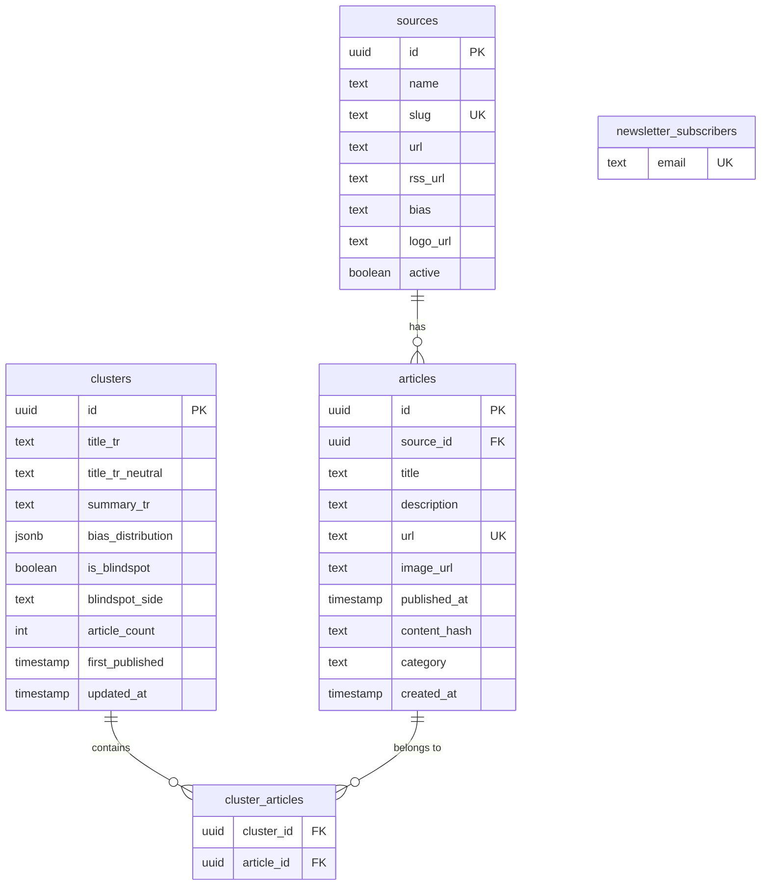

# Architecture

## System Overview

Tayf is a Next.js 16 application that aggregates Turkish news from 144 RSS sources, clusters related articles, and presents bias analysis. The system has two main data paths: a continuous RSS worker (primary) and HTTP-triggered ingestion (fallback), both writing to a shared Supabase PostgreSQL database.

```mermaid
graph TB
    subgraph "Data Ingestion"
        W[RSS Worker<br/>tmux/60s cycle] -->|upsert| DB[(Supabase<br/>PostgreSQL)]
        CRON[/api/cron/ingest<br/>HTTP fallback/] -->|upsert| DB
        BF[/api/cron/backfill-images/] -->|update image_url| DB
    end

    subgraph "Next.js 16 App"
        HOME[/ Home<br/>Ranked cluster feed]
        BLIND[/blindspots<br/>One-sided coverage]
        DETAIL[/cluster/id<br/>Full story detail]
        SRC[/sources<br/>Source directory]
        SRCPF[/source/slug<br/>Source profile]
        TL[/timeline<br/>24h chronological]
        TR[/trends<br/>30-day chart]
        ADMIN[/admin<br/>Management panel]
    end

    subgraph "API Routes"
        API_ADMIN[/api/admin]
        API_HEALTH[/api/health]
        API_METRICS[/api/metrics]
        API_NEWS[/api/newsletter]
    end

    DB --> HOME
    DB --> BLIND
    DB --> DETAIL
    DB --> SRC
    DB --> SRCPF
    DB --> TL
    DB --> TR
    DB --> ADMIN
    DB --> API_ADMIN
    DB --> API_HEALTH
    DB --> API_METRICS

    HOME --> DETAIL
    SRC --> SRCPF
```

## Data Model



## Key Modules

### Data Layer (`src/lib/`)

| Module | Responsibility |
|---|---|
| `clusters/politics-query.ts` | Fetches, filters (≥60% politics), dedupes, wire-collapses, caps source fairness, and importance-ranks clusters for the home feed. Single PostgREST embedded select. |
| `clusters/cluster-detail-query.ts` | Fetches a single cluster with all members + full source directory. Two parallel round-trips. |
| `bias/config.ts` | Single source of truth for bias labels, colors, spectrum order, and the 10→3 zone mapping. |
| `bias/cross-spectrum.ts` | Detects "surprise" outlets covering a story dominated by the opposing zone. Guards: ≥5 sources, ≥0.65 threshold, ≥3 absolute margin. |
| `bias/analyzer.ts` | Bias distribution calculator and blindspot detector. |
| `rss/fetcher.ts` | Parallel RSS feed fetcher with per-source header overrides and 15s timeout. |
| `rss/normalize.ts` | Article normalization: URL canonicalization, content hashing (SHA256), HTML entity decoding, keyword-based category classification, sports source force-tagging. |
| `rss/og-image.ts` | Fetches `og:image` from article pages (reads only first 50KB up to `</head>`). |
| `sources/factuality.ts` | Hand-tagged factuality + ownership metadata for ~30 outlets. |
| `rate-limit.ts` | In-memory token-bucket rate limiter with periodic idle-bucket cleanup. |

### Ranking Pipeline (`politics-query.ts`)

The home feed ranking combines five signals:

```
score = W_ARTICLE_COUNT * log2(effectiveCount + 1)
      + W_ZONE_DIVERSITY * log2(distinctZones + 1)
      - W_TIME_DECAY * (ageHours / 6)
      - W_DOMINANCE_PENALTY * oneSourceDominance
      + W_VELOCITY * velocity
```

Where `effectiveCount = min(wireCollapsedCount, sourceFairnessCappedCount)`.

### Blindspot Detection (`blindspots/page.tsx`)

Clusters qualify as blindspots when:
1. ≥5 distinct sources (post same-source dedupe)
2. Dominant Medya DNA zone share ≥80%
3. ≥60% politics/breaking-news category
4. First published ≥24h ago (time-lag artifact filter)
5. ≥50% distinct content hashes (wire filter)
6. ≤50% dünya category (foreign affairs filter)
7. No SEO pattern titles (kimdir, kaç yaşında, etc.)

## Caching Strategy

Tayf uses Next.js 16 Cache Components (`"use cache"` directive) with named cache profiles:

| Profile | stale | revalidate | expire | Used by |
|---|---|---|---|---|
| `cluster-feed` | 30s | 30s | 300s | Home feed, cluster detail, timeline, blindspots |
| `source-directory` | 60s | 300s | 3600s | Sources page, source profiles |

Cache tags (`cacheTag`) enable targeted invalidation: `clusters`, `clusters-politics`, `cluster-detail:{id}`, `sources`, `articles`.

## Security

- **CSP headers** on all routes (script/style/img/connect directives)
- **HSTS**, X-Content-Type-Options, X-Frame-Options, Referrer-Policy, Permissions-Policy
- **Rate limiting** on mutating endpoints (admin POST, newsletter, cron ingest/backfill)
- **CRON_SECRET** bearer token for cron endpoints
- **robots.txt** disallows `/admin` and `/api/`
- Wildcard `images.remotePatterns` — acceptable because image URLs enter only through the RSS normalizer, never from user input

## External Dependencies

| Dependency | Purpose |
|---|---|
| Supabase | PostgreSQL database + PostgREST API |
| `rss-parser` | RSS/Atom feed parsing |
| `crypto-js` | SHA256 content hashing for article dedup |
| `@base-ui/react` | Headless UI primitives (Dialog, Select, Button, etc.) |
| `class-variance-authority` | Component variant management |
| `tailwind-merge` + `clsx` | Class name composition |
| `lucide-react` | Icon library |
| Google Fonts | DM Serif Display, Plus Jakarta Sans, JetBrains Mono |
