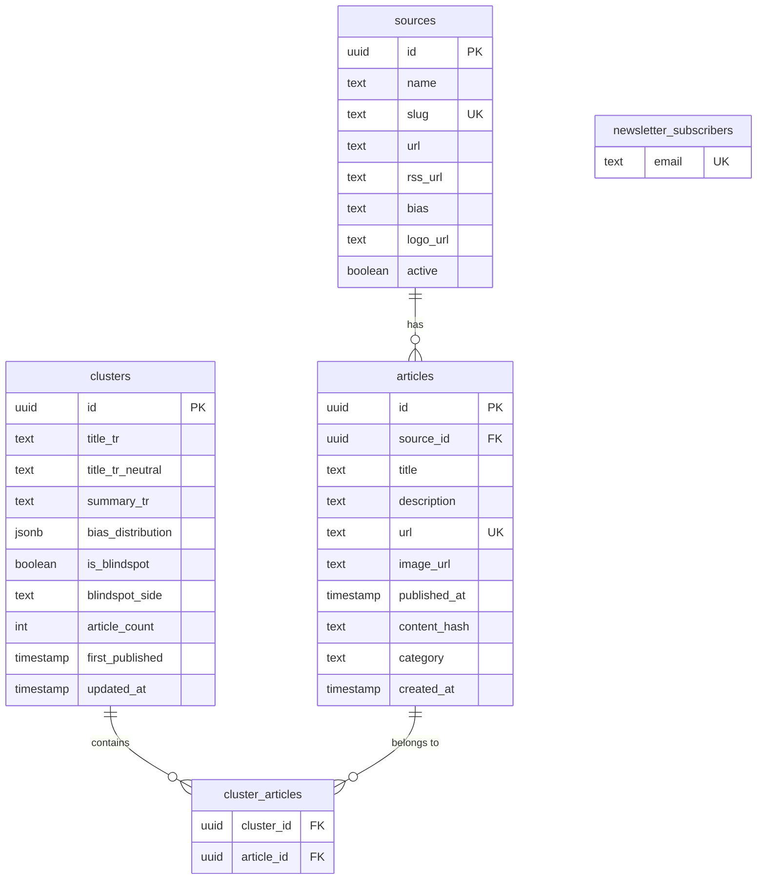

# Architecture

## System Overview

Tayf is a Next.js 16 application that aggregates Turkish news from 144 RSS sources, clusters related articles, and presents bias analysis. Ingestion and clustering run as an **event-driven worker stream** on Supabase: a `pg_cron` `ingest-drain` job pokes the `ingest` Edge Function, an `AFTER INSERT` trigger pushes work onto `pgmq` queues, and parallel `pg_cron` `cluster-drain` / `image-drain` jobs drain those queues into co-located `cluster-consumer` and `image-consumer` Edge Functions. The previous tmux-based long-running workers (`scripts/rss-worker.mjs`, `scripts/cluster-worker.mjs`, `scripts/image-worker.mjs`) are decommissioned. The only Vercel cron in the new pipeline is `/api/cron/headline`.

For the full ADR (decision matrix, alternatives considered, audit findings addressed, migration plan), see [`../tayf-refactor/architecture/ADR-001-worker-stream-system.md`](../tayf-refactor/architecture/ADR-001-worker-stream-system.md).

```mermaid
graph TB
    subgraph "Vercel cron"
        HEADLINE_CRON[/api/cron/headline<br/>*/5 * * * */]
    end

    subgraph "Supabase pg_cron"
        PGCRON_INGEST[ingest-drain<br/>*/3 * * * *]
        PGCRON_C[cluster-drain<br/>* * * * *]
        PGCRON_I[image-drain<br/>*/5 * * * *]
    end

    subgraph "Supabase Edge Functions (Deno)"
        INGEST[ingest<br/>RSS fan-out + normalize + upsert]
        CLUSTER[cluster-consumer<br/>3-method ensemble]
        IMAGE[image-consumer<br/>og:image backfill, SSRF-safe]
    end

    subgraph "Supabase Postgres"
        ART[(articles)]
        CL[(clusters / cluster_articles)]
        QC[(pgmq: cluster_work)]
        QI[(pgmq: image_backfill)]
        WM[(worker_metrics view)]
    end

    PGCRON_INGEST -->|net.http_post| INGEST
    INGEST -->|upsert| ART
    ART -.AFTER INSERT trigger.-> QC
    ART -.AFTER INSERT image_url IS NULL.-> QI
    PGCRON_C -->|net.http_post| CLUSTER
    PGCRON_I -->|net.http_post| IMAGE
    CLUSTER -->|read+archive| QC
    CLUSTER -->|upsert| CL
    IMAGE -->|read+archive| QI
    IMAGE -->|update image_url| ART
    HEADLINE_CRON -->|fill title_tr_neutral| CL

    subgraph "Next.js 16 App"
        HOME[/ Home<br/>Ranked cluster feed]
        BLIND[/blindspots]
        DETAIL[/cluster/id]
        SRC[/sources]
        SRCPF[/source/slug]
        TL[/timeline]
        TR[/trends]
        ADMIN[/admin]
    end

    subgraph "API Routes"
        API_ADMIN[/api/admin]
        API_HEALTH[/api/health<br/>reads worker_metrics]
        API_METRICS[/api/metrics<br/>reads worker_metrics]
        API_NEWS[/api/newsletter]
    end

    CL --> HOME
    CL --> BLIND
    CL --> DETAIL
    ART --> TL
    ART --> TR
    WM --> API_HEALTH
    WM --> API_METRICS
```

## Worker stream pipeline

| Stage | Surface | Cadence | Responsibility |
|---|---|---|---|
| Ingest trigger | pg_cron `ingest-drain` → `net.http_post` | `*/3 * * * *` | Service-role-bearer-checked invocation of the `ingest` Edge Function, scheduled inside Postgres so the cron registry (`cron.job`) is the single source of truth for the worker stream's cadence |
| Ingest | Supabase Edge Function `ingest` | per invocation | Fans out across 144 RSS sources with a concurrency-bounded pool, charset-aware decode (CP1254 / iso-8859-9 + UTF-8), unified sha1-of-shingles `content_hash`, idempotent upsert into `articles` |
| Enqueue | Postgres trigger `AFTER INSERT ON articles` | per row | `pgmq.send('cluster_work', ...)` for politics articles; `pgmq.send('image_backfill', ...)` when `image_url IS NULL` |
| Cluster drain | Edge Function `cluster-consumer`, scheduled by `pg_cron` | `* * * * *` | `pgmq.read(vt=60, qty=50)` → run 3-method ensemble → upsert into `clusters` + `cluster_articles` → `pgmq.archive` on success, `pgmq.delete` on permanent failure (>3 reads) |
| Image drain | Edge Function `image-consumer`, scheduled by `pg_cron` | `*/5 * * * *` | Fetch first 50 KB of article URL, extract `og:image` / `twitter:image`, SSRF guard (RFC1918/169.254/loopback/IPv6 link-local), update `articles.image_url` |
| Headline | Vercel cron `/api/cron/headline` | `*/5 * * * *` | LLM-generated neutral Turkish title for new clusters lacking `title_tr_neutral` |

The pgmq queues give at-least-once delivery with visibility timeouts; `worker_checkpoint` and the `worker_metrics` view feed `/api/health` and `/api/metrics`. Cold-start risk on the Edge Functions is mitigated by the regular pg_cron cadence keeping the instances warm.

## Data Model



## Key Modules

### Data Layer (`src/lib/`)

| Module | Responsibility |
|---|---|
| `clusters/politics-query.ts` | Fetches, filters (≥60% politics), dedupes, wire-collapses, caps source fairness, and importance-ranks clusters for the home feed. Single PostgREST embedded select. |
| `clusters/cluster-detail-query.ts` | Fetches a single cluster with all members + full source directory. Two parallel round-trips. |
| `bias/config.ts` | Single source of truth for bias labels, colors, spectrum order, and the 10→3 zone mapping. |
| `bias/cross-spectrum.ts` | Detects "surprise" outlets covering a story dominated by the opposing zone. Guards: ≥5 sources, ≥0.65 threshold, ≥3 absolute margin. |
| `bias/analyzer.ts` | Bias distribution calculator and blindspot detector. |
| `rss/fetcher.ts` | Parallel RSS feed fetcher with per-source header overrides and 15s timeout. |
| `rss/normalize.ts` | Article normalization: URL canonicalization, content hashing (SHA256), HTML entity decoding, keyword-based category classification, sports source force-tagging. |
| `rss/og-image.ts` | Fetches `og:image` from article pages (reads only first 50KB up to `</head>`). |
| `sources/factuality.ts` | Hand-tagged factuality + ownership metadata for ~30 outlets. |
| `rate-limit.ts` | In-memory token-bucket rate limiter with periodic idle-bucket cleanup. |

### Ranking Pipeline (`politics-query.ts`)

The home feed ranking combines five signals:

```
score = W_ARTICLE_COUNT * log2(effectiveCount + 1)
      + W_ZONE_DIVERSITY * log2(distinctZones + 1)
      - W_TIME_DECAY * (ageHours / 6)
      - W_DOMINANCE_PENALTY * oneSourceDominance
      + W_VELOCITY * velocity
```

Where `effectiveCount = min(wireCollapsedCount, sourceFairnessCappedCount)`.

### Blindspot Detection (`blindspots/page.tsx`)

Clusters qualify as blindspots when:
1. ≥5 distinct sources (post same-source dedupe)
2. Dominant Medya DNA zone share ≥80%
3. ≥60% politics/breaking-news category
4. First published ≥24h ago (time-lag artifact filter)
5. ≥50% distinct content hashes (wire filter)
6. ≤50% dünya category (foreign affairs filter)
7. No SEO pattern titles (kimdir, kaç yaşında, etc.)

## Caching Strategy

Tayf uses Next.js 16 Cache Components (`"use cache"` directive) with named cache profiles:

| Profile | stale | revalidate | expire | Used by |
|---|---|---|---|---|
| `cluster-feed` | 60s | 300s | 3600s | Home feed, cluster detail, timeline, blindspots |
| `source-directory` | 60s | 300s | 3600s | Sources page, source profiles |

Cache tags (`cacheTag`) enable targeted invalidation: `clusters`, `clusters-politics`, `cluster-detail:{id}`, `sources`, `articles`.

## Security

- **CSP headers** on all routes (script/style/img/connect directives)
- **HSTS**, X-Content-Type-Options, X-Frame-Options, Referrer-Policy, Permissions-Policy
- **Rate limiting** on mutating endpoints (admin POST, newsletter, cron ingest/backfill)
- **CRON_SECRET** bearer token for cron endpoints
- **robots.txt** disallows `/admin` and `/api/`
- Wildcard `images.remotePatterns` — acceptable because image URLs enter only through the RSS normalizer, never from user input

## External Dependencies

| Dependency | Purpose |
|---|---|
| Supabase | PostgreSQL database + PostgREST API |
| `rss-parser` | RSS/Atom feed parsing |
| `crypto-js` | SHA256 content hashing for article dedup |
| `@base-ui/react` | Headless UI primitives (Dialog, Select, Button, etc.) |
| `class-variance-authority` | Component variant management |
| `tailwind-merge` + `clsx` | Class name composition |
| `lucide-react` | Icon library |
| Google Fonts | DM Serif Display, Plus Jakarta Sans, JetBrains Mono |
